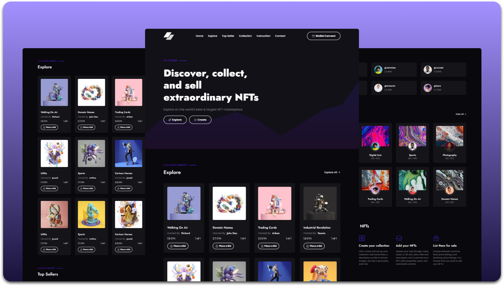

# NFT MarketPlace
### Demo Screeshots



### Prerequisites

Before you begin, ensure you have met the following requirements:

* [Git](https://git-scm.com/downloads "Download Git") must be installed on your operating system.

### Run Locally

To run **NFTC** locally, run this command on your git bash:

Linux and macOS:

```bash
sudo git clone https://github.com/RizanKhan837/NFT-Marketplace.git
```

Windows:

```bash
git clone https://github.com/RizanKhan837/NFT-Marketplace.git
```

### Contact

If you want to contact with me you can reach me at [LinkedIn](https://www.linkedin.com/in/rizwanakram837/).

### License

This project is **free to use** and does not contains any license.
"# NFT-Marketplace" 
